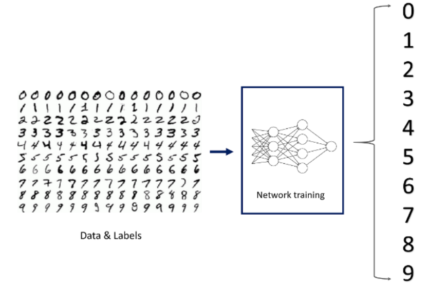
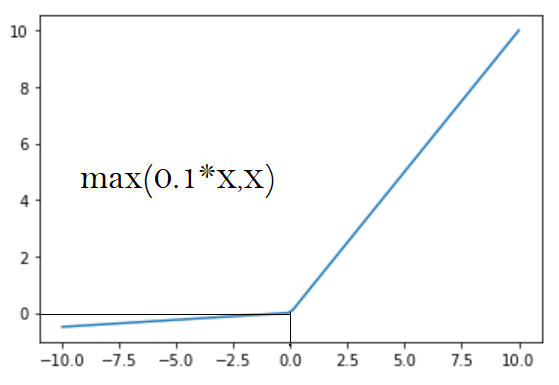

## Topics
- Deep Learning and History
- Multi-Layer Perceptron
- Types of Activation Functions
- Types of Loss Functions
- Training Neural Networks
- 

## Neural Networks
 - Photolithography
 - Neuron
 - - 86 Billions Neurons in Brain
 - A preception is the simplest neural network unit, taking multiple binary inputs and producing a single binary output. This is foundational to early neural nwtwork development.
 - Perceptron
 - **Epoch**: The number of times the entire training dataset is processed by the learning algorithm during training.
# Training

- Gradient Descent
- - Local vs Globals Minima
- - Back Propagation
-  Activation Fuctions
-  Loss Functions
-  Bias: To Set the threshhold for activation
-  In a perceptron model, the bias acts as an adjustable parameter that shifts the threshold for neuron activation. By adjusting the bias, we can control the point at which the weighted sum of inputs surpasses the threshold, determining whether the neuron fires or remains inactive.
-  The primary role of an activation function in a neural network is to introduce non-linearity, enabling the network to learn complex patterns and relationships in data. By applying non-linear transformations to the input signals, activation functions allow neural networks to capture and represent intricate patterns that linear functions cannot express, thus facilitating better performance in modeling real-world phenomena
-  Weights and Biases
-   

---
## Summarizing Multi-Layer Perceptron
Deep learning helps in solving complex problems, and how a perceptron mimics the human neuron to solve simpler problems. Instead of having a single perceptron, put a bunch of perceptrons together and see how they perform a task. 

Let’s have a quick look at the workings of a Perceptron. 

Consider a single perceptron that takes some inputs, performs the weighted summation of the inputs, and applies the sigmoid function. 

The sigmoid function forms an S-shaped graph, where x approaches infinity, the probability becomes 1, and as x approaches negative infinity, the probability becomes 0.

The Logistic regression performs the same as a single perceptron. It finds a model that takes the input, finds the coefficients (as perceptron weights), and predicts the output. Building a logistic regression model is similar to training a perceptron. 

When training data X is passed to a perceptron, it returns predicted values called yhat, which should be as close to the actual target values as possible. To achieve this, the neural network will start with some random weights and adjust the weights iteratively by finding the derivatives with respect to each of the weights to get the predictions as close to the actual values as possible.

Instead of a single perceptron, multiple perceptrons are connected to form a deep neural network structure. The first layer is known as the Input layer, the final layer is known as the Output layer, and the layers lying between the input and output layers are known as the Hidden layer. Each layer could have a different number of neurons.

The Bias term in the neural network is the same as the intercept in the line equation. This bias term is the same theta or threshold value in McCulloch Pitts neuron. Instead of having this value in the function, it is added as part of inputs having weight associated with it. 

Every node (neuron) contains a bias term, which may or may not be explicitly showcased in the neural network architecture. A neural network has a bunch of inputs, and every node has some weight. It computes the weighted summation of the input, applies the activation function, passes the output to the next layer, and so on.
---
## Summarizing MNIST Dataset

The most popular dataset used in neural networks is the MNIST (Modified National Institute of Standards and Technology) dataset. It contains 60,000 handwritten images of the digits from 0 to 9 in the training dataset. Each image is 28*28 pixels of 0s and 1s (Pixels are scaled), where 0 stands for black and 1 stands for white. A model can be trained on this data to recognize hand-written numbers

A 28*28 image gives 784 inputs, and the target variable has a value from 0 to 9, so the output layer will have 10 nodes, each node corresponding to a digit from 0 to 9. The number of neurons and hidden layers are the hyperparameters in Neural Networks that can be changed.

The output from the above model will give 10 numbers, and each number represents the probability of the number being 0, 1, 2 … 9, and it is called predicted y.
The predicted values should be close to the actual values, so to achieve this derivatives/gradients of predicted y with respect to all the weights are calculated. 
From derivatives, how predicted y changes or in which direction it changes with respect to each of the weights is determined.
So, derivatives/gradients are used to adjust the weights so that the predicted y becomes close to the actual y. 
Multiple perceptrons, when put together in a well-designed structure and more importantly trained with the relevant data in the right manner, can show signs of being intelligent. 

The structure that is built above is known as Feed Forward, and it essentially feeds the input, and everything computed in a given layer is moved to the next layer, and so on. When every node in each layer is connected to every node in the next immediate layer, the structure is known as a Fully Connected Neural Network.

---
In linear regression, the commonly used error function is the Mean Squared Error (MSE), which calculates the average squared difference between the predicted values and the actual values. This helps to quantify the overall performance of the regression model in fitting the data.

In gradient descent, the "gradient" represents the rate of change of the weights and biases with respect to the cost function.

The primary objective of the gradient descent algorithm in machine learning is to minimize the error between predicted and actual values. By iteratively adjusting the model parameters (weights and biases) in the direction of the steepest descent of the cost function, gradient descent aims to find the optimal set of parameters that minimize the prediction error.

---
## Backward Propagation
- The backpropagation algorithm utilizes the chain rule from calculus to efficiently compute the gradient of the loss function with respect to the weights of the network. This gradient is then used to update the weights during the training process, allowing the network to learn and improve its performance over time
- Backpropagation is indeed the process through which a neural network adjusts its weights during training to minimize the error between the predicted output and the actual output. This involves iteratively propagating the error backwards from the output layer to the input layer, recalibrating the weights to improve the network's performance.
-  
---
## Activation Functions
- Statement II correctly identifies that the main difference between sigmoid and tanh activation functions lies in their output ranges, with sigmoid ranging from 0 to 1 and tanh ranging from -1 to 1.

Statement III is also true, as the tanh function domain is the entire real number line.
- f(x)=max(0,x), represents the Rectified Linear Unit (ReLU) activation function. This function returns the maximum of 0 and the input x, effectively replacing negative values with zero while leaving positive values unchanged.
- The ReLU (Rectified Linear Unit) activation function indeed has a range of 
[0,∞], as it sets all negative inputs to zero and leaves positive inputs unchanged. This property ensures that ReLU outputs only non-negative values.
- The output of an output layer with softmax activation function gives the probability that sums up to 1.
- Softmax is used as an activation function in the output layer for multiclass classification problems.
- --
## Summarizing Types of Activation Function - Part 1

1. **Step Function:** One of the most basic categories of activation functions is the Step Function. A threshold value is used in this case, and if the net input y value is greater than the threshold, the neuron is activated.

A binary step function is a threshold-based activation function, which means that it activates when a certain threshold is reached and deactivates when it falls below that point. Because there is a sharp jump in the function, the derivative at x=o will give a large number, but that large number is not useful for learning and cannot be used for multi-class classification. Smooth functions are good for learning where there are defined slopes and this step function is a sharp function.
2. **Sigmoid Activation:** This activation function looks like a smoother version of a step function where the slopes at each point are well defined, and this smoothness is caused by using the exponential function.

The sigmoid function, also known as the logistic function, has an output that ranges from 0 to 1. It makes use of a probabilistic approach. It is a function that is graphed in the shape of a "S." The sigmoid activation function has a value between 0 and 1. Because the values of the Sigmoid function range between 0 and 1, the outcome can be easily predicted to be 1 if the value is greater than 0.5 and 0 otherwise. In the output layer of a binary classification, Sigmoid function values are typically used, with the result being either 0 or 1.

3. **Tanh Activation:** Tanh activation function is a scaled and compressed version of sigmoid activation function and is also called a hyperbolic tangent. The structure of this function is similar to the sigmoid activation function, but significantly superior because it allows for negative outputs and has an output range of -1 to 1.

4. **ReLU Activation:** Rectified linear activation function is the most commonly used activation function in the hidden layer of a neural network which ranges between 0 to inf.

if X>=0, X

if X<0, 0

If x is positive, it outputs x, and if not, it outputs 0. The ReLU activation function has a range of 0 to inf. 

The advantage of ReLU is that it requires fewer mathematical operations than tanh and sigmoid, making it less computationally expensive. 

The disadvantage of ReLu is that it produces dead neurons, which never activate, known as the dying ReLu problem.
---
## Summarizing Types of Activation Function - Part 2

1. **Linear activation function:** The linear activation function is one in which the activation is proportional to the input. This function does nothing to the weighted sum of the input and returns the value it was given.

The activation function of the last layer is merely a linear function of the input from the first layer, regardless of how many layers there are, assuming they are all linear. The linear activation function has a range of -inf to +inf. The neural network's last layer will operate as a linear function of the first layer.

2. **Leaky ReLU:** The Leaky ReLU function is an improved version of the ReLU activation function. The gradient of the ReLU activation function is 0 for all input values less than zero, which deactivates the neurons in that region and may cause the dying ReLU problem.

Leaky ReLU is defined to address this problem. Instead of defining the ReLU activation function as 0 for negative values of inputs (x), we define it as an extremely small linear component of x. Here is the formula for this activation function

f(x)=max(0.01*x , x)

If the above function receives any positive input, it returns x; otherwise, it returns a small value equal to 0.01 times x. As a result, it produces an output for any negative values. By making this small change, the gradient on the left side of the above graph becomes non-zero. As a result, it would no longer encounter dead neurons in that area.

3. **Softmax Activation:** The softmax function is often described as a combination of multiple sigmoids. The sigmoid activation function returns values between 0 and 1, which are the probabilities of each of the data points belonging to a particular class. Thus, sigmoid is widely used for binary classification problems.

But the softmax activation function is used in the output layer of multi-class classification problems, where this function returns the probability for a datapoint belonging to each individual class. The range of softmax is -inf to inf. Below is the mathematical expression for softmax.

The function normalizes the outputs for each class between 0 and 1 and adds the normalized sum for each class. The output for a particular class is its normalized output divided by the total normalized sum.

**Choosing the right activation function in the output layer:**

---
- After normalizing the data, the pixel values in the MNIST dataset are scaled to the range [0, 1]. Previously, the range was [0, 255].

Normalizing the dataset

x_train, x_val, x_test = x_train.astype("float32")/(255), x_val.astype("float32")/(255), x_test.astype("float32")/(255)

- Gradient descent minimizes the cost function by adjusting model parameters using the slope(gradient) to find the direction of the steepest decrease in the loss landscape.
- Kersas facilitates neural network tasks with functions for building, compiling, training, and evaluating models, incorporating layers optimizers, loss functions and utilities.
- Softmax is an activation functions that transforms a vectort of real numbers into a probability distribution. It is commonly used in the output layer of a neural network for multi-class classification.
- The softmax activation function is used in the output layer. Softmax is commonly used for multi-class classification problems as it converts the output values into probabilities that sum up to 1.
- Compiling a model in TensorFlow involves specifying the loss function and optimizer that will be used during the training process. The loss function measures the error between the predicted and actual values, and the optimizer updates the model's weights based on the calculated loss.
---
#Initializing the neural network
model = Sequential()
model.add(Dense(128,activation='relu',input_dim = x_train.shape[1]))
model.add(Dense(64,activation='tanh'))
model.add(Dense(num_classes, activation = 'softmax'))
First Hidden Layer:

model.add(Dense(128, activation='relu', input_dim=x_train.shape[1]))
This line adds the first hidden layer with 128 neurons (units) using the Rectified Linear Unit (ReLU) activation function.
The input_dim parameter specifies the number of features in the input data, which is determined by x_train.shape[1].
Second Hidden Layer:

model.add(Dense(64, activation='tanh'))
This line adds the second hidden layer with 64 neurons and uses the hyperbolic tangent (tanh) activation function.
The input_dim is not explicitly specified here because the model already "knows" the input dimension from the first layer.
Output Layer:

model.add(Dense(num_classes, activation='softmax'))
This line adds the output layer with the number of neurons equal to the number of classes (assuming num_classes is appropriately defined).
The softmax activation function is used for multi-class classification problems.
So, there are two hidden layers in this neural network model: one with 128 neurons and ReLU activation, and another with 64 neurons and tanh activation.

---

Increasing the number of epochs in training a model typically results in a longer training time. This is because each epoch involves running the model through the entire dataset, and as the number of epochs increases, the model has to iterate over the data more times. Hence, it takes more time to complete the training process. However, it's important to note that the relationship between the number of epochs and training time may not always be linear, as other factors such as batch size and model complexity can also influence the training time.
---
The number of weight updates during backpropagation is given by:

Number of Weight Updates=(Number of Rows in Dataset / Batch Size)×Number of Epochs

Substituting the given values:

Number of Weight Updates=(1000 / 10)×10=1000

Therefore, the weights will be updated 1000 times during the backpropagation process when a batch size of 10 and an epoch of 10 are applied to a dataset of 1000 rows.
---
## FAQ
FAQ - Introduction to Deep Neural Networks
1) What is a Neural Network?
Neural Networks replicate the way humans learn, inspired by how the neurons in our brains fire, only much simpler.

The most common Neural Networks consist of three network layers:

An input layer
A hidden layer (this is the most important layer where feature extraction takes place, and adjustments are made to train faster and function better)
An output layer
Each sheet contains neurons called “nodes,” performing various operations. Neural Networks are used in deep learning algorithms like CNN, RNN, GAN, etc.

 

2) What are hyperparameters?
With neural networks, you’re usually working with hyperparameters once the data is formatted correctly. A hyperparameter is a parameter whose value is set before the learning process begins. It determines how a network is trained and the structure of the network (such as the number of hidden units, the learning rate, epochs, etc.).

 

3) How to install TensorFlow on Windows or Mac?
Open the Anaconda Prompt (on Windows) or Terminal (on Mac) and run the following code
pip install tensorflow --user 
Open the Jupyter Notebook and refresh the page. Now, check the version of the TensorFlow by importing it with the following code in the notebook:
import tensorflow as tf
print(tf.__version__)
 

4) What are activation functions?
In simple terms, an artificial neuron calculates the ‘weighted sum’ of its inputs and adds a bias.

Now the value of net input can be anything from -∞ to +∞. The neuron doesn’t know how to bound to value and thus is not able to decide the firing pattern. Thus the activation function is an important part of an artificial neural network. They decide whether a neuron should be activated or not. Thus it bounds the value of the net input.

The activation function is a non-linear transformation that we perform on the input before sending it to the next layer of neurons or finalizing it as output.

 

5) What are the Softmax and ReLU functions?
Softmax is an activation function that generates the output between zero and one and ensures that the sum of the outputs is equal to one. As such, it gives us a probability distribution.

Softmax is most commonly used with output layers of a neural network.
ReLU (or Rectified Linear Unit) is the most widely used activation function. It gives an output of x if x is positive and zero otherwise.

ReLU is most commonly used with hidden layers of a neural network.
 

6) What is Gradient Descent?
Gradient Descent is an optimization algorithm to minimize the cost function or to minimize an error. The aim is to find the local/global minima of a function. The algorithm determines the direction the model should take to reduce the error and also the magnitude (or extent) of movement.
---
## References

- https://medium.com/@subedibipin/boolean-algebra-and-logic-gates-58549f1a2578#:~:text=Logic%20gates%20are%20fundamental%20electronic,%2C%20%E2%80%9Con%20or%20off%E2%80%9D.
- Getting started with Tensorflow: https://www.tensorflow.org/
- Activate Functions: https://ml-cheatsheet.readthedocs.io/en/latest/activation_functions.html
- Back Propagation: https://mattmazur.com/2015/03/17/a-step-by-step-backpropagation-example/
- Multi-Class classification: https://machinelearningmastery.com/multi-class-classification-tutorial-keras-deep-learning-library/ 